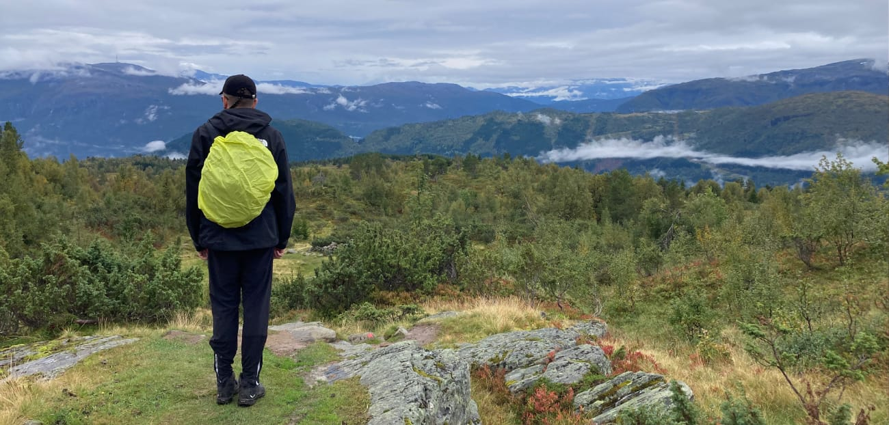
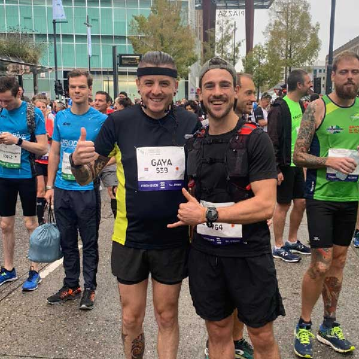

# About Gaya Kessler

> I am a freelance web developer specialising in JavaScript, living in Deurne, a small town in the south of The Netherlands, close to Eindhoven.

I've been a developer professionally since 2006. That's about half of the time I've been alive!

<picture class="picture picture--fullwidth">
    
</picture>

Since I was young **I've always had an interest in creating things** with a computer. This varied from creating video games, drawing, making music, and eventually programming.

Because I had the possibility to learn computer science during my time in high school I got a taste of what it could be to do this for a living. I couldn't believe **something this much fun was actually a job** I could get paid for. 

From my room in my parents' attic and a really slow internet connection, I started learning how to **code websites from scratch** and program the back-end systems supporting it.

I later went to university to get a **bachelors degree in Computer Science**. Around the same time I got a part-time job at a [local web development company](https://cybox.nl), where I learned a lot more than what school was teaching. I'll be forever thankful for the opportunity I got working there.

<picture class="picture picture--daantje">
    
</picture>

Because I was learning so much, and fast, I decided it was a good idea to [write down what I was learning](https://gaya.pizza) about in a weblog. To this day I still **write from time to time**, but rarely. It helps me collect my thoughts and share them with the world.

More recently I started writing again on [sauce.gaya.pizza](https://sauce.gaya.pizza).

I've worked as an employee at a handful of different companies throughout the years. This allowed me to _not only_ grow from a _technical perspective_, but also _personally_. In my opinion I've grown so much because I worked at such a variety of different companies and projects. This also allows me to **know what I am good at**, and which working environments suit me best. 

Through the years I've always centred the work I do around **learning and challenging myself**. I love sharing this knowledge and have **spoken at various meetups and conferences**. Sharing knowledge and helping people improve their skills is something I get the most satisfaction out off.

<picture class="picture picture--whisky">
    
</picture>

One of the things I seem to like the best was _JavaScript_ and making a web page interactive. I tried to do as much work with JavaScript and tried to utilise it for projects at jobs I had in order to **hone my skills**.

For the sake practising and learning even more **I started a lot of side-projects**. Such as [Drammit](https://dramm.it) where I wanted to create my own app. This project saw a few iterations where I learned a lot of new techniques which I then was able to apply in my day-to-day job.

After ten years of working at companies, I thought it was time to **move on and work freelance**. This has allowed me to work for awesome companies like [Philips](https://philips.com), [Route42](https://route42.nl), [Intoto](https://intoto.io), [BrewPi](https://brewpi.com), and [Dekode](https://dekode.no). Whilst also creating more breathing room for my personal endeavours.

<picture class="picture picture--marathon">
    
</picture>

Apart from development and programming I like to take enough time off to enjoy life away from the desk.

I volunteer at [Bureau voor Pedagogiek](https://www.bureauvoorpedagogiek.nl/) where I help autistic youngsters with all things related to computer science. From learning to program, building games, or [making their own robots](https://sauce.gaya.pizza/helping-build-a-self-driving-robot/).

I am a **runner**, which helps me both physically and mentally. I created [Create My Run](https://createmy.run), a small web application where runners can generate their runs based on location and distance they'd wish to run.

You can find me at **loud music** concerts drinking a beer and banging my head. I also play in a band called Dead Soil, and [share some solo music on Youtube](https://www.youtube.com/channel/UChnJcc3EMvjjzx_yc0nUuSA).

Recently I picked up learning guitar and enjoying it a lot!

Jeg har lært meg å snakke litt norsk. Nå er jeg på en B2 nivå og forstå og er ganske forståelig for nordmenn. Men du må bare se selv om du vil!

I live with three rescue **cats**: Dexter, Darwin, and Donnie.

I love to **cook** for me and my wife, friends, and family.

I believe living a **sustainable lifestyle** is best for the planet, animals, the people I love, and myself.

## Let's get in touch

<ul class="find-online">
    <li>
        <a class="find-me find-me--mail" href="#contact">
            Contact me
        </a>
    </li>
    <li>
        <a class="find-me find-me--twitter" href="https://twitter.com/GayaKessler">
            Follow on Twitter
        </a>
    </li>
    <li>
        <a class="find-me find-me--linkedin" href="https://www.linkedin.com/in/gaya-kessler/">
            Connect on LinkedIn
        </a>
    </li>
</ul>
